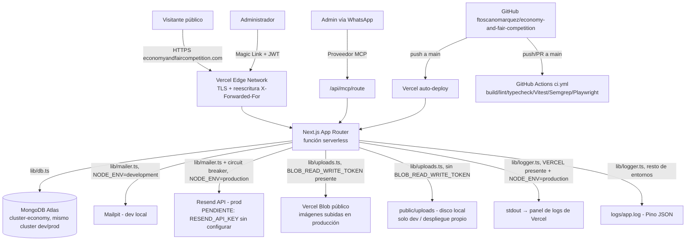
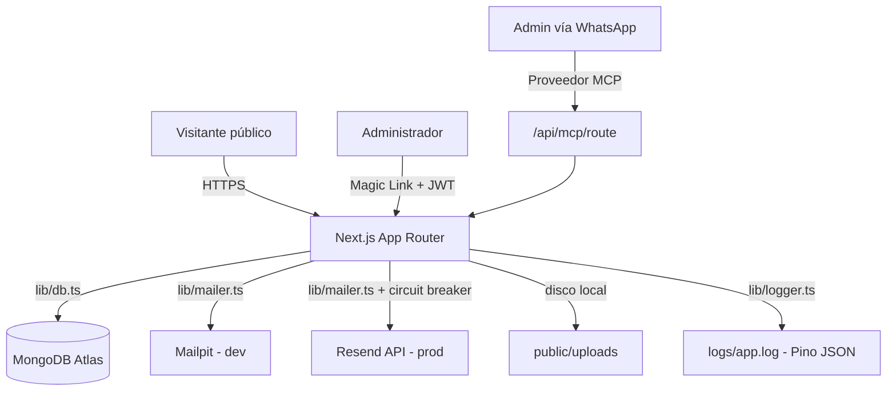
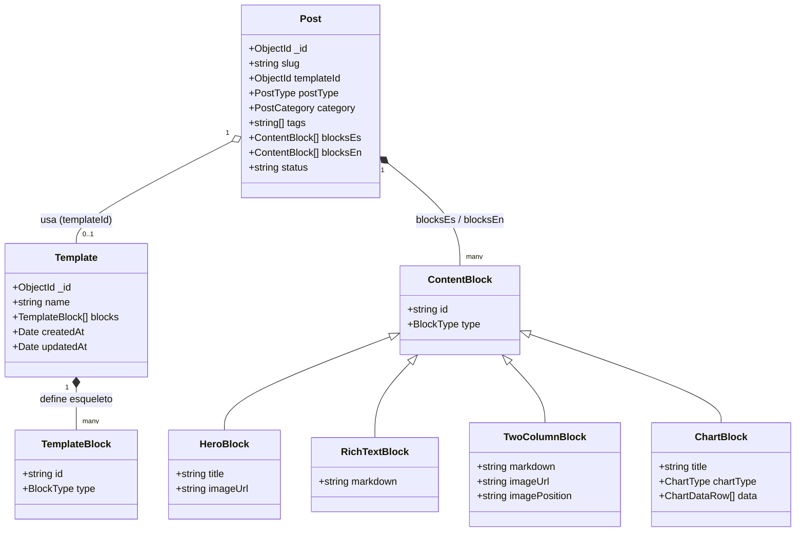
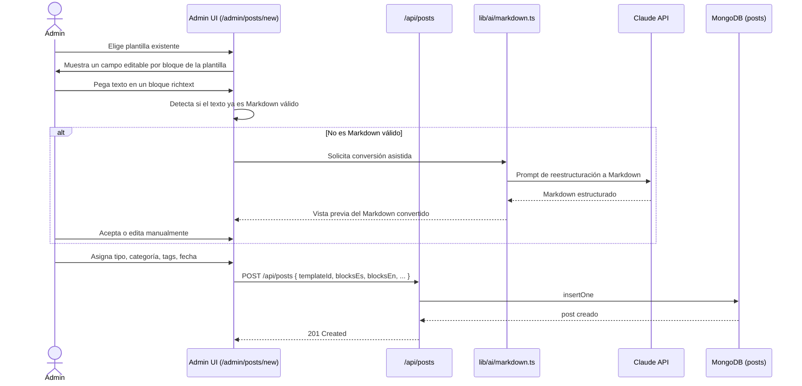
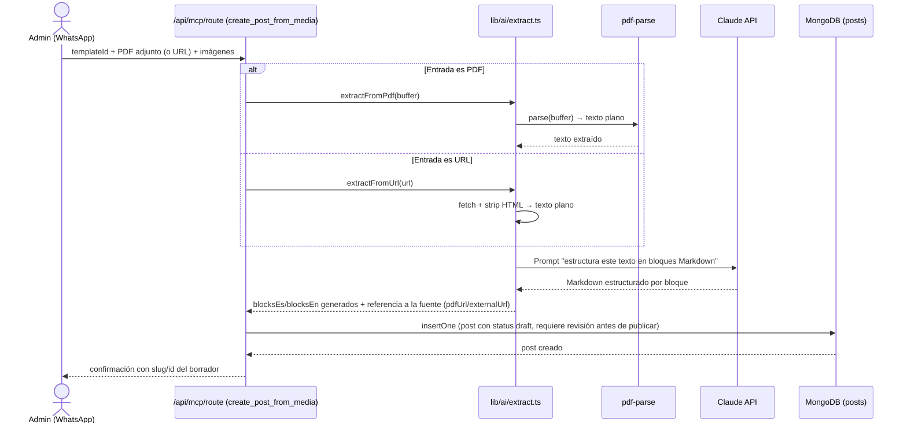
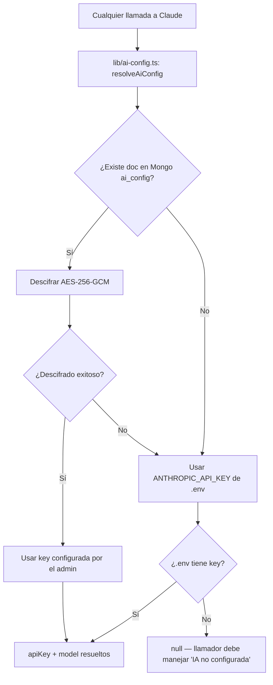

# DIAGRAMAS.md

> Diagramas de clase, máquina de estados, secuencia y modelo de persistencia. Se completan en Fase 11 cuando la arquitectura de todas las fases está implementada y estable. Esqueleto y primer diagrama de contexto creados en Fase 0.

## Diagrama de contexto general — producción real (Vercel, cerrado 2026-08-07)

**Notas de la migración documentadas en `HISTORY.md`** (2026-08-07): el filesystem de Vercel es de solo lectura para el código desplegado y no persiste entre deploys — esto forzó dos cambios respecto al diseño original de "servidor propio" (`AGENTS.md` §1, `INFRA.md`): el logger escribe a `stdout` en vez de a archivo cuando corre en Vercel, y las imágenes subidas van a Vercel Blob en vez de a disco. Ambos cambios son automáticos (detectan el entorno vía `process.env.VERCEL`/`BLOB_READ_WRITE_TOKEN`) y no alteran el comportamiento en desarrollo local ni en un eventual despliegue propio con disco persistente.

## Diagrama de contexto general original (borrador previo a Fase 11, referencia histórica de diseño)

## Sistema de plantillas y bloques (Fase 7, en construcción)

### Relación Plantilla → Post → Bloques

Una `Template` es solo el esqueleto (secuencia de tipos de bloque, sin contenido). Un `Post` referencia una plantilla vía `templateId` y lleva el contenido real de cada bloque, duplicado por idioma (`blocksEs`/`blocksEn`) — misma estructura, mismo orden de bloques, contenido independiente.

### Flujo: creación de un Artículo/Nota desde el admin (Fase 7C)

### Flujo: creación desde WhatsApp/MCP con PDF o URL (Fase 7F, planeado)

### Resolución de la API key de IA (admin vs. .env)

## Pendiente para Fase 11

- [ ] Diagrama de clases completo (agregar SiteText, AdminUser, AuthCode, ContactSubmission a lo ya documentado arriba).
- [ ] Máquina de estados: magic link (`issued` → `verified` / `expired` / `too_many_attempts`).
- [ ] Máquina de estados: circuit breaker (`CLOSED` → `OPEN` → `HALF_OPEN` → `CLOSED`).
- [ ] Diagrama de secuencia: flujo completo de login admin (request-code → Mailpit/Resend → verify-code → JWT → cookie de sesión).
- [ ] Modelo de persistencia (ERD lógico completo de las colecciones Mongo).
